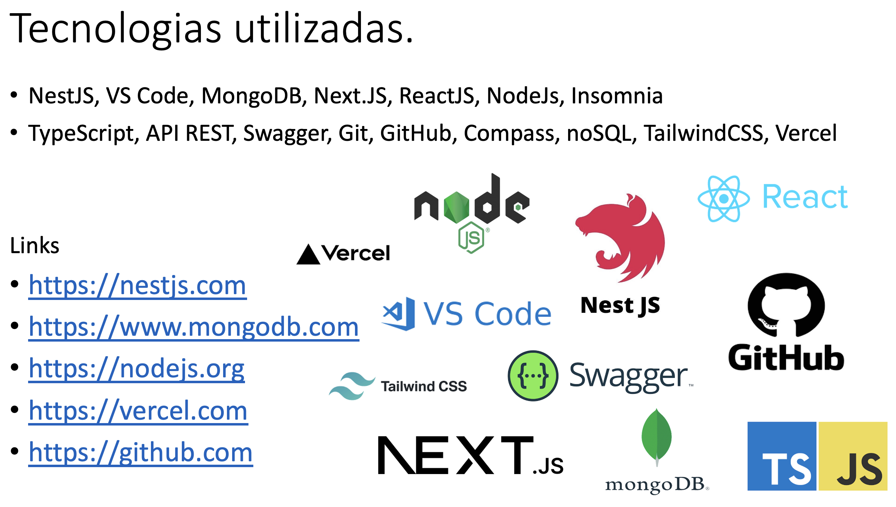
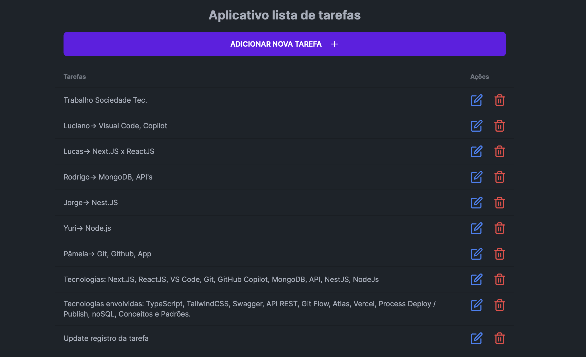

## Aplicação Web 
- Esse projeto faz parte de um trabalho proposto pelo Prof. Zé Benedito da matéria Sociedade e Tecnologia.
- Trata-se de um aplicativo de lista de tarefas escrito em typescript utilizando Next.js
- O trabalho é apresentar inovações na área de desenvolvimento e analise.
- Apresentar ferramentas e tecnologias que estão sendo utilizadas na atualidade.

Este é um projeto simples, sendo o front-end da solução, também é composto por uma aplicação de back-end e um banco de dados noSQL, essa solução por mais simples que seja demonstra uma quantidade significativa de tecnologias, ferramentas, utilitários, linguagens, frameworks e bibliotecas. Demonstrando como é uma solução profissional, simples e organizada, bem projetada, robusta e com possibilidade de se escalar.

## Tecnologia


## Aplicação


## Projeto Back-end API
[Repositório da API](https://github.com/jhchiarelli/todolistapi-fatec.git)

This is a [Next.js](https://nextjs.org/) project bootstrapped with [`create-next-app`](https://github.com/vercel/next.js/tree/canary/packages/create-next-app).

## Getting Started

First, run the development server:

```bash
npm run dev
# or
yarn dev
# or
pnpm dev
# or
bun dev
```

Open [http://localhost:3000](http://localhost:3000) with your browser to see the result.

You can start editing the page by modifying `app/page.tsx`. The page auto-updates as you edit the file.

This project uses [`next/font`](https://nextjs.org/docs/basic-features/font-optimization) to automatically optimize and load Inter, a custom Google Font.

## Learn More

To learn more about Next.js, take a look at the following resources:

- [Next.js Documentation](https://nextjs.org/docs) - learn about Next.js features and API.
- [Learn Next.js](https://nextjs.org/learn) - an interactive Next.js tutorial.

You can check out [the Next.js GitHub repository](https://github.com/vercel/next.js/) - your feedback and contributions are welcome!

## Deploy on Vercel

The easiest way to deploy your Next.js app is to use the [Vercel Platform](https://vercel.com/new?utm_medium=default-template&filter=next.js&utm_source=create-next-app&utm_campaign=create-next-app-readme) from the creators of Next.js.

Check out our [Next.js deployment documentation](https://nextjs.org/docs/deployment) for more details.
